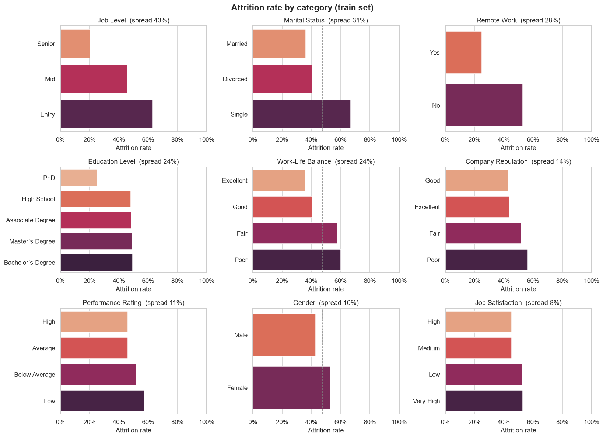

# Employee Attrition Prediction

[](https://colab.research.google.com/github/RachitSethi2455/employee-attrition-prediction/blob/main/employee_attrition_classification.ipynb)


This project predicts whether an employee will **leave** a company from HR attributes and explains what drives attrition. It benchmarks six classifiers on one leak-free scikit-learn pipeline, tunes the best with cross-validation, and reports results on a held-out test set that is used only once.

**Result:** tuned Histogram Gradient Boosting reaches **76.0% accuracy, 0.852 ROC-AUC and 0.747 F1** for the *Left* class on 14,900 unseen employees.


## Highlights

- **Leak-free pipeline.** Encoding and scaling sit inside a `Pipeline`/`ColumnTransformer`, so they are fit on training folds only.
- **Encoding that respects the data.** Ordered categories such as *Poor < Fair < Good < Excellent* keep their real order. Nominal features are one-hot encoded.
- **Proper evaluation protocol.** Models are compared on a validation split, the winner is tuned with 5-fold CV, and the score on the untouched `test.csv` is reported once.
- **Explainability.** Permutation importance shows which features the model actually relies on.

## Results

**Validation split (11,920 employees):** all models use default settings and the same pipeline.

| Model | Accuracy | ROC-AUC | F1 (Left) | Fit time |
|---|---|---|---|---|
| **Hist. Gradient Boosting** | **0.755** | **0.849** | **0.743** | 0.7 s |
| Random Forest (300 trees) | 0.745 | 0.837 | 0.729 | 2.5 s |
| SVM (RBF) | 0.744 | 0.836 | 0.729 | 90 s |
| Logistic Regression | 0.738 | 0.828 | 0.723 | 0.3 s |
| KNN (k=15) | 0.706 | 0.779 | 0.695 | 1.2 s |
| Decision Tree | 0.664 | 0.663 | 0.647 | 0.5 s |

**Held-out test set (14,900 employees), tuned gradient boosting:**

| Accuracy | ROC-AUC | Precision (Left) | Recall (Left) | F1 (Left) |
|---|---|---|---|---|
| **0.760** | **0.852** | 0.745 | 0.749 | 0.747 |


## What drives attrition?


- **Career stage matters most.** 63% of entry-level employees left, compared with 20% of senior employees. Fewer promotions also means higher risk.
- **Personal situation.** Single employees leave at 67%, compared with 36% for married ones. Employees with more dependents are less likely to leave.
- **Working conditions.** Remote workers leave at 25% vs 53% for everyone else. Poor or fair work-life balance raises attrition to about 58%, and a longer commute adds risk.
- **Surprisingly weak signals:** monthly income, overtime and job satisfaction barely separate leavers from stayers in this data.



## Run it

```bash
git clone https://github.com/RachitSethi2455/employee-attrition-prediction.git
cd employee-attrition-prediction
pip install -r requirements.txt
jupyter notebook employee_attrition_classification.ipynb
```

On the first run, the notebook downloads the dataset into `data/` with [`kagglehub`](https://github.com/Kaggle/kagglehub). The whole notebook runs in about 6 minutes on a laptop CPU, and most of that time goes to fitting the SVM and the CV search.

## Dataset

[Employee Attrition Classification Dataset](https://www.kaggle.com/datasets/stealthtechnologies/employee-attrition-dataset) (Kaggle, stealthtechnologies) has 74,498 **synthetic** employee records with 22 features and an `Attrition` target (*Stayed* / *Left*). It comes as `train.csv` (59,598 rows) and `test.csv` (14,900 rows), with no missing values and no overlapping employee IDs.

## Notebook outline

1. Setup
2. Load data (auto-download)
3. Exploratory analysis: target balance, attrition rate by category, numeric distributions
4. Preprocessing pipeline
5. Model comparison: metrics table, ROC curves, confusion matrices
6. Hyperparameter tuning with 5-fold CV
7. Final test-set evaluation
8. Permutation feature importance
9. Takeaways

## Limitations & next steps

- The data is **synthetic**, so the drivers describe the generator rather than a real workforce.
- Tuning added only about 0.003 AUC over the defaults. The next gains would have to come from features, not hyperparameters.
- Next steps: threshold tuning for a recall-oriented retention use case, probability calibration, SHAP explanations for individual employees, and fairness checks (e.g. gender, marital status) before any real-world use.

## Tech

Python · pandas · scikit-learn · seaborn · matplotlib · kagglehub

## License

Code is released under the [MIT License](LICENSE). The dataset keeps its own Kaggle license.
