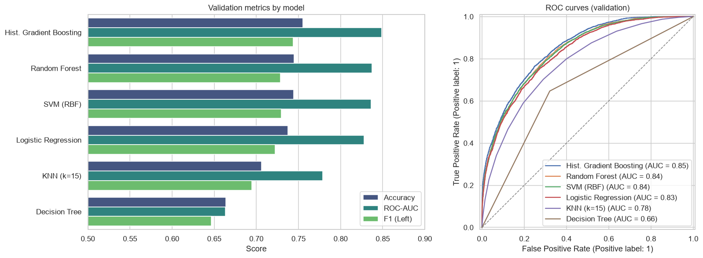
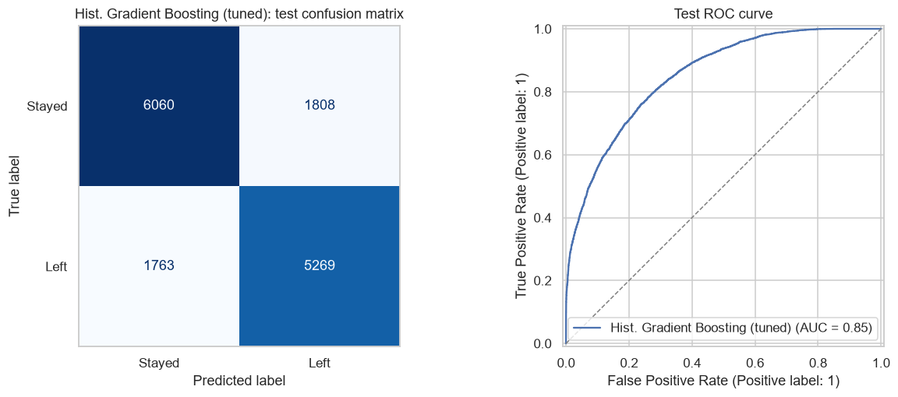
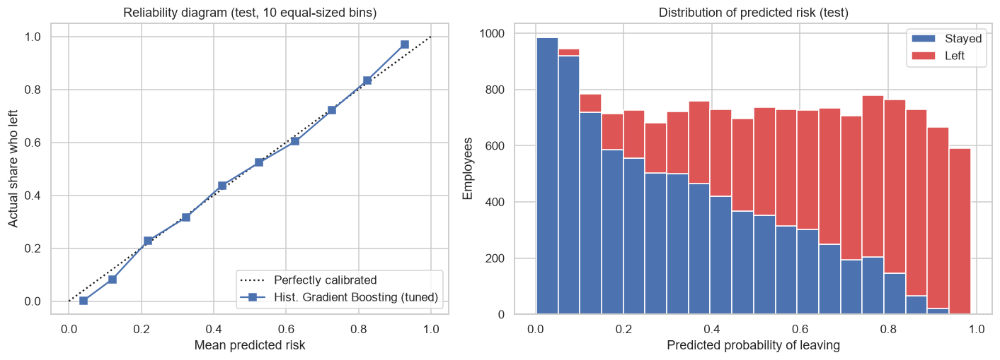
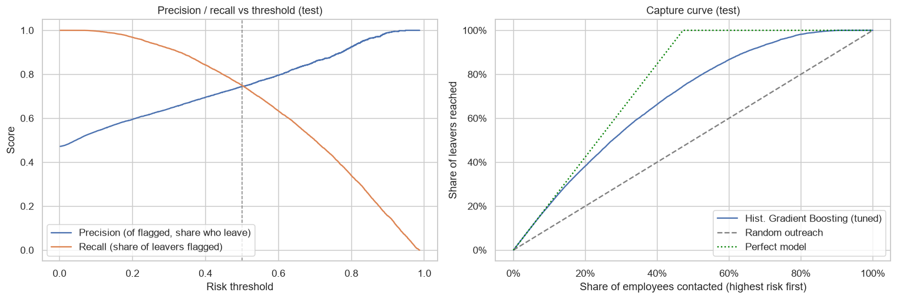
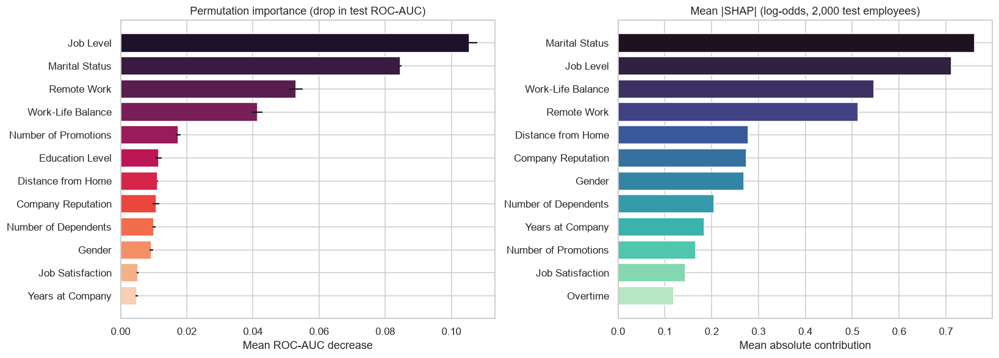
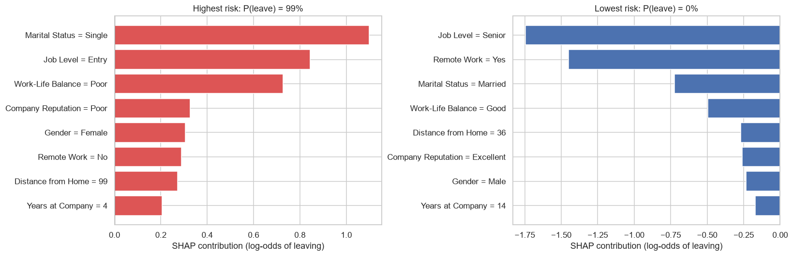

# Employee Attrition Prediction

[](https://github.com/RachitSethi2455/employee-attrition-prediction/actions/workflows/ci.yml)
[](https://colab.research.google.com/github/RachitSethi2455/employee-attrition-prediction/blob/main/employee_attrition_classification.ipynb)


[](LICENSE)

This project predicts whether an employee will **leave** a company from HR attributes, explains *why* for each employee, and checks whether the model treats demographic groups fairly. It benchmarks six classifiers on one leak-free scikit-learn pipeline, tunes the best with cross-validation, and reports results on a held-out test set that is used only once. An interactive demo app is included.

**Result:** tuned Histogram Gradient Boosting reaches **76.0% accuracy and 0.852 ROC-AUC** on 14,900 unseen employees. Contacting the **20% highest-risk employees reaches 38% of all leavers, with 90% precision** (1.9× random outreach).



## Highlights

- **Leak-free pipeline.** Encoding and scaling sit inside a `Pipeline`/`ColumnTransformer`, so they are fit on training folds only. Ordered categories (*Poor < Fair < Good < Excellent*) keep their real order.
- **Proper evaluation protocol.** Models are compared on a validation split, the winner is tuned with 5-fold CV, and the score on the untouched `test.csv` is reported once.
- **From scores to decisions.** A capture curve and a budget table show what an HR team gains by contacting the top *k%* of employees ranked by risk.
- **Trustworthy probabilities.** A reliability diagram shows the predicted risks are well calibrated (expected calibration error 0.019), so "70% risk" really means about 70%.
- **Explainability.** Permutation importance shows global drivers. **SHAP** splits each individual prediction into per-feature contributions that add up exactly to the model output.
- **Fairness audit.** Flag rates, true- and false-positive rates are compared across gender and marital status, plus an ablation without those attributes.
- **Engineering.** Shared code lives in the [`attrition/`](attrition) package, which the notebook, the [demo app](app.py) and the [unit tests](tests) all import. CI runs the tests on every push.

## Results

**Validation split (11,920 employees):** all models use default settings and the same pipeline.

| Model | Accuracy | ROC-AUC | F1 (Left) | Fit time |
|---|---|---|---|---|
| **Hist. Gradient Boosting** | **0.755** | **0.849** | **0.743** | 0.7 s |
| Random Forest (300 trees) | 0.745 | 0.837 | 0.729 | 2.5 s |
| SVM (RBF) | 0.744 | 0.836 | 0.729 | 90 s |
| Logistic Regression | 0.738 | 0.828 | 0.723 | 0.3 s |
| KNN (k=15) | 0.706 | 0.779 | 0.695 | 1.2 s |
| Decision Tree | 0.664 | 0.663 | 0.647 | 0.5 s |

**Held-out test set (14,900 employees), tuned gradient boosting:**

| Accuracy | ROC-AUC | Precision (Left) | Recall (Left) | F1 (Left) |
|---|---|---|---|---|
| **0.760** | **0.852** | 0.745 | 0.749 | 0.747 |



## Can the probabilities be trusted?

Retention targeting and the demo both use the model's **probabilities**, so they should mean what they say. Test employees are grouped into 10 equal-sized bins by predicted risk, and each bin's prediction is compared with its actual attrition rate:

- **Expected calibration error is 0.019**, and the Brier score is 0.157, which is 37% better than predicting the base rate for everyone.
- Between about 20% and 85% predicted risk, the actual attrition rate matches the prediction to within about 2 points.
- At the extremes the model is slightly cautious: it predicts 4% for the safest tenth, where 0.3% leave, and 93% for the riskiest tenth, where 97% leave.



## Using the scores: retention targeting

HR teams usually have budget to reach a fixed share of employees, not to act on a 0.5 threshold. Ranking employees by predicted risk:

| Contact the top… | Share of leavers reached | Of those contacted, share who leave | Lift vs random |
|---|---|---|---|
| 10% | 20.6% | 97.1% | 2.06× |
| **20%** | **38.2%** | **90.2%** | **1.91×** |
| 30% | 53.5% | 84.2% | 1.78× |
| 50% | 77.4% | 73.0% | 1.55× |



## What drives attrition?



- **Career stage:** 63% of entry-level employees left, compared with 20% of senior employees. Fewer promotions also means higher risk.
- **Personal situation:** single employees leave at 67%, compared with 36% for married ones. Employees with more dependents are less likely to leave.
- **Working conditions:** remote workers leave at 25% vs 53% for everyone else. Poor or fair work-life balance raises attrition to about 58%, and a longer commute adds risk.
- **Surprisingly weak signals:** monthly income, overtime and job satisfaction barely separate leavers from stayers in this data.

SHAP explains individual predictions as well. Below are the highest-risk and lowest-risk employees in a test sample:



## Fairness audit

Gender and marital status are model inputs, so the model's errors are compared group by group on the test set:

| Group | Actual attrition | Flagged by model | True-positive rate | False-positive rate |
|---|---|---|---|---|
| Female | 52.4% | 55.1% | 79.1% | 28.7% |
| Male | 42.8% | 41.1% | 70.6% | 19.0% |
| Single | 66.6% | 73.3% | 88.4% | 43.4% |
| Married | 35.6% | 32.3% | 61.2% | 16.3% |
| Divorced | 41.3% | 38.8% | 64.4% | 20.8% |

- **The model amplifies existing group differences.** Single employees are flagged 73% of the time against an actual attrition rate of 67%. Stayers who are single are wrongly flagged at **2.7× the rate** of married stayers (43% vs 16%), and stayers who are women at 1.5× the rate of men (29% vs 19%).
- **Removing Gender and Marital Status costs 5 points of ROC-AUC** (0.852 → 0.802) and nearly closes the flag-rate gaps (from 14 to 0.3 points by gender, and from 41 to 1 by marital status). Attrition rates genuinely differ between these groups in the data, so choosing between the two models is a **policy decision**, not a purely technical one.

## Demo app

[`app.py`](app.py) is a [Gradio](https://gradio.app) app. Enter an employee profile and it returns the risk of leaving, a Low/Medium/High band, and a SHAP chart of the factors behind that prediction. Three one-click example profiles show the range: a typical employee (30% risk), an entry-level single employee with poor work-life balance (96%), and a senior married remote worker (0.3%).

```bash
pip install -r requirements.txt
python app.py          # opens http://127.0.0.1:7860
```

It loads the tuned pipeline from [`models/attrition_model.joblib`](models). The file is 145 KB and is saved by the notebook. Its metrics and settings are recorded in [`models/model_card.json`](models/model_card.json).

## Run it

```bash
git clone https://github.com/RachitSethi2455/employee-attrition-prediction.git
cd employee-attrition-prediction
pip install -r requirements.txt jupyter
jupyter notebook employee_attrition_classification.ipynb
```

On the first run, the notebook downloads the dataset into `data/` with [`kagglehub`](https://github.com/Kaggle/kagglehub). The full run takes about 7 minutes on a laptop CPU, and most of that time goes to fitting the SVM and the CV search. The "Open in Colab" badge also works, because the first cell fetches the repo's package.

Run the tests with `pip install pytest && pytest`. They use synthetic rows, so they need no download.

## Project structure

```
attrition/
  data.py        feature schema, Kaggle download, X/y split
  pipeline.py    preprocessing, model zoo, metrics
  explain.py     SHAP contributions summed per original feature
models/          saved pipeline + model card (written by the notebook)
tests/           unit tests (synthetic data)
app.py           Gradio demo
employee_attrition_classification.ipynb
```

## Dataset

[Employee Attrition Classification Dataset](https://www.kaggle.com/datasets/stealthtechnologies/employee-attrition-dataset) (Kaggle, stealthtechnologies) has 74,498 **synthetic** employee records with 22 features and an `Attrition` target (*Stayed* / *Left*). It comes as `train.csv` (59,598 rows) and `test.csv` (14,900 rows), with no missing values and no overlapping employee IDs.

## Limitations & next steps

- The data is **synthetic**, so the drivers and group gaps describe the generator rather than a real workforce.
- Tuning added only about 0.003 AUC over the defaults. The next gains would have to come from features, not hyperparameters.
- Next steps: fairness-aware thresholds per group, and checking real HR data for **proxy features** that could reintroduce a removed attribute.

## Tech

Python · scikit-learn · SHAP · Gradio · pandas · seaborn · matplotlib · pytest · GitHub Actions

## License

Code is released under the [MIT License](LICENSE). The dataset keeps its own Kaggle license.
